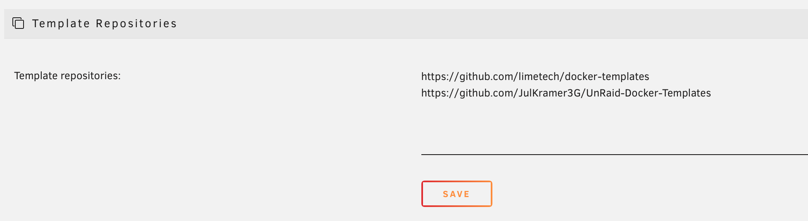
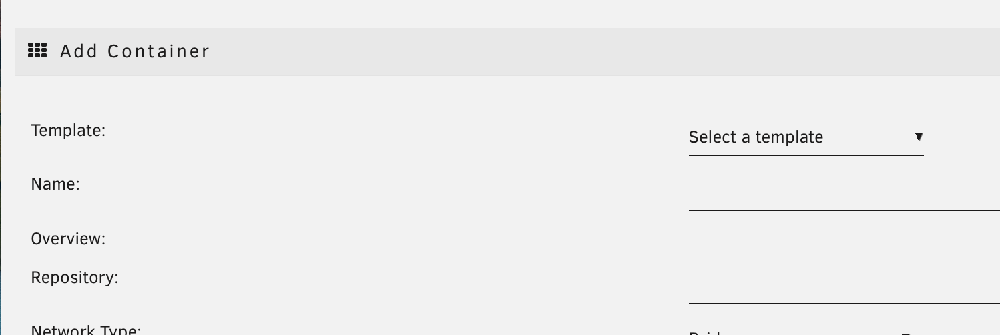

## unRAID Docker Templates

:bangbang: UnRaid **only** loads templates from the **master** branch, if your primary branch is named **main**, it will not work!

:bangbang: This uses the template version 2 (UnRaid v6.2+), for reference see https://wiki.unraid.net/DockerTemplateSchema

### Usage

* Add this repository to the UnRaid templates field:

* Use the template when creating a new container:
